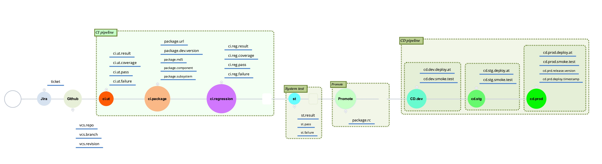
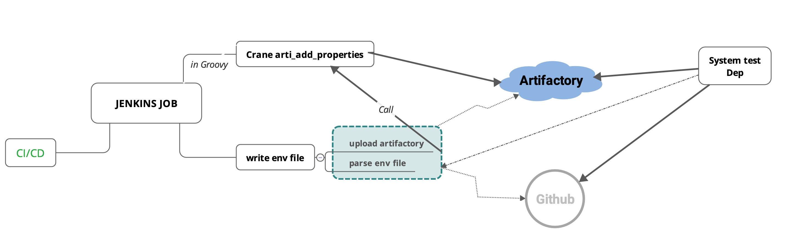

# Requirements
1.  We want to trace a package life cycle.
    1.1 When this package factory ?  who promote ?

    1.2 When this package deploy on stg/prod,  smoke test result ?

    1.3 Associated UT/RT result and coverage, which case fail ?

    1.4 Which feature/bug is contained in package or not ?

    1.5 What's version in stg/prod ?

2. Convergence metric include CI, CD,  github,  Jira.
   2.1 Is a feature/bug pass UT/RT or not ?

   2.2 Which feature/bug metric associated with the package ?

   2.3 How is master/release branch CI UT/RT result trend ?

   2.4 How many hotfix deploy after a release ?

3. We want to collect details testcase metric
   3.1 Which test case always fail ?

   3.2 UT/RT report collect separately

# Life Cycle Chart

# Audit Flow Chart

# Env Naming Rule

1. VCS info   (version control system)
   vcs.x.key
   
   vcs.x.revision
   
   vcs.x.branch
   
   vcs.x.repo
   
   there may be more than one repo associated, so x is the repo number 0, 1, 2...
   
   E.g.    vcs.1.revision = ec0e5d17b8825b06eab522e9a78607d47fcd2d9d,   vcs.2.branch = master , vcs.3.repo=git@github.freewheel.tv:core/common.git

2. CI info

   ci.[ut|rt|pg|package|sc|xxx].[result|coverage|failure|pass]
   
   ci.ut.result
   
   ci.ut.coverage
   
   ci.ut.pass
   
   ci.ut.failure
   
   ci.ut.report.url
   
   ci.sc.high
   
   ci.sc.report.url
   
   E.g.  ci.ut.result=PASS,  ci.ut.coverage=0.87,  ci.rt.pass=58 ci.rt.failure=3

3. CD info

   cd.env.key  cd.[dev|stg|prod].[deploy|smoke].[test|at]
   
   cd.dev.deploy.at
   
   cd.dev.smoke.test
   
   cd.stg.deploy.at
   
   cd.prod.deploy.at
   
   cd.dev.package.url
   
   E.g. cd.dev.deploy.at='2019-05-07 16:58:53' ,  cd.dev.smoke.test=PASS

4. Package info

   package.x.[url|version|component|subsystem|team]
   
   package.x.url
   
   package.x.version
   
   package.x.component
   
   package.x.subsystem
   
   subsystem: Name of subsystem in MOD. For example: ui / ads / data / oltp_lite
   
   component: Name of component within a subsystem. For example: dal / invoice ...

5. System Test info

   st.xxx.abc
   
   E.g. st.pass =

6. User define info

   user.xyz.abc

   E.g.  user.deploy.weather=fine

# Typical user scenario
1. query latest package on stg
   precondition:   tag on stg deploy pipeline:  cd.stg.deploy.at
   
   AQL: query latest cd.stg.deploy.at package

2. query latest package pass regression test
   precondition:   tag on ci pipeline:   ci.rt.result

   AQL: query latest package with ci.rt.result = PASS

3. check a package life cycle, UT coverage, RT coverage or deploy on stg
   check a package's property ci.ut.coverage, ci.rt.coverage,  cd.stg.deploy.at

4. check a package release note, contain a feature or not
   precondition:  tag revision, repo, branch on CI pipeline.

   check a package's revision property associate with github API find diff commits' msg with Jira ticket no, then we can identify a feature ticket is  in package or not

5. query a package with user special mark
   precondition:  tag user mark on CI pipeline

   AQL: query package with this user mark

