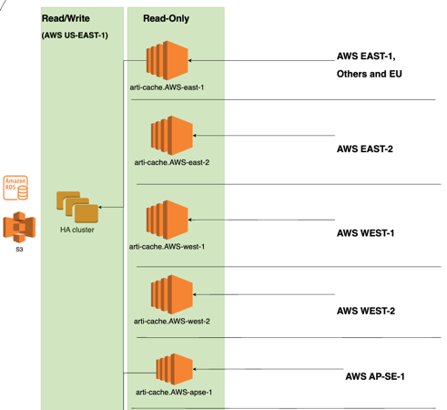
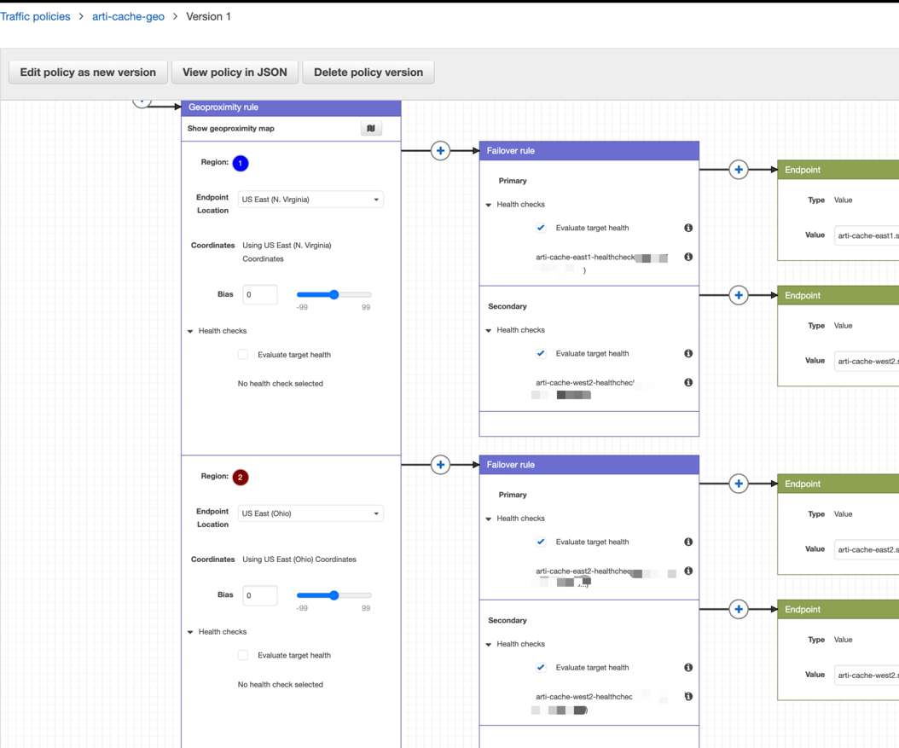

# Requirements and Background
Only one domain name arti-cache.domain.net for user download from anywhere, both on Prime and AWS.
Minimize downtime for online services as much as possible, or implement service degradation (read-only mode) as an alternative.

# Arti-Cache Topology


# Aws Route53 Traffic Policy
Policy Details: Artifactory Aws Route53 Traffic Policy


# Prefer Practice
Cached Files Lifecycle: 180 days. If the cached files are not used in 180 days, they will be automatically removed from the current cache server. You can recache them from the primary source if needed.

1. If you need to query the artifact property data, please use the primary domain (arti.domain.tv) in your pipeline.
For example:
   You need to query the vcs.branch property before downloading the artifacts.

2. Use the cache domain (arti-cache.domain.tv) to download artifacts in your CI/CD pipeline or deployment script.
For example: 
````
   wget https://arti-cache.domain.tv/artifactory/generic/ep/cicd/Artifactory.repo
   docker pull arti-cache.domain.tv/ep/cicd/nginx:latest
````
3. Use Https

   For example:
   
   wget https://arti-cache.domain.tv/artifactory/generic/ep/iaas/Artifactory.repo Correct
   wget http://arti-cache.domain.tv/artifactory/generic/ep/iaas/Artifactory.repo Incorrect


4. Use the virtual repo path for the HTTPS URL

   The cache synchronizes artifacts with the primary repository through the remote repository, providing only addresses based on the virtual repo path.
   
   For example:
   
   wget https://arti-cache.domain.tv/artifactory/generic/ep/cicd/Artifactory.repo Correct
   
   wget https://arti-cache.domain.tv/artifactory/generic-local/ep/cicd/Artifactory.repo Incorrect

# Cache Sync Practice
Consider how to quickly restore online services in DR scenarios. It is recommended that the prod env deployment package be proactively synchronized with all cache nodes after the prod deployment is completed in your CD pipelines to ensure that it is available on all AWS Cache nodes.


