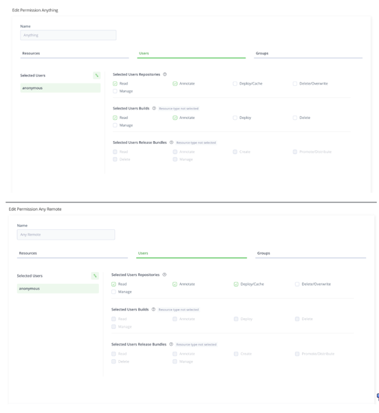

# Documents:
https://www.jfrog.com/confluence/display/JFROG/Installing+Artifactory#InstallingArtifactory-RPMInstallation

https://www.jfrog.com/confluence/display/JFROG/Configuring+the+Database

https://www.jfrog.com/confluence/display/JFROG/MySQL

# AWS Resource
    Aws Load Balancer
    Aws Rout53
    Aws RDS (This is not required, you can also install Mysql on the instances)

# Install Steps
https://jfrog.com/help/r/jfrog-installation-setup-documentation/installing-artifactory-edge
https://www.jfrog.com/confluence/display/JFROG/Installing+Artifactory#InstallingArtifactory-RPMInstallation

```
sudo su -

# install base tool
yum install -y telnet git gd gperftools-libs libxslt nginx


mkdir -p /opt/nginx/conf/conf.d/

cp artifactory/misc/nginx/artifactory.conf /opt/nginx/conf/conf.d/

systemctl restart nginx

# install artifactorywget https://releases.jfrog.io/artifactory/artifactory-pro-rpms/artifactory-pro-rpms.repo -O /etc/yum.repos.d/jfrog-artifactory-pro-rpms.repo
yum install -y jfrog-artifactory-pro --disablerepo="*" --enablerepo="Artifactory-pro"
# install mysql
yum install mariadb-server
systemctl enable mysqld.service
systemctl start mysqld.service
grep 'temporary password' /var/log/mysqld.log
#2022-01-06T08:19:57.569766Z 1 [Note] A temporary password is generated for root@localhost: wDMV?G)wg4nT
mysql -uroot -p
# modify password
ALTER USER 'root'@'localhost' IDENTIFIED BY 'Fr332021!';
# import arti db
source /opt/jfrog/artifactory/app/misc/db/createdb_mysql.sql

# modify mysql default: https://www.jfrog.com/confluence/display/JFROG/MySQL#MySQL-IncreasingMySQLDefaultPacketSize
cat /etc/my.cnf
systemctl restart mysqld.service
chown -R artifactory:artifactory /opt/jfrog/artifactory/
chown -R artifactory:artifactory /opt/jfrog/artifactory/var/
# modify system.yaml
cd /opt/jfrog/artifactory/var/etc/
<<COMMENT
database:
type: mysql
driver: com.mysql.jdbc.Driver
url: jdbc:mysql://localhost:3306/artdb?characterEncoding=UTF-8&elideSetAutoCommits=true&useSSL=false&useSSL=false
username: artifactory
password: Fr332021!
COMMENT

# add slave plugins

cp artifactory/plugins/slave.* /opt/jfrog/artifactory/var/etc/artifactory/plugins/


systemctl start artifactory.service

```

Web UI Default User:

User: admin, Password: password

Edge smart remote repo trust
https://jfrog.com/help/r/jfrog-platform-administration-documentation/how-to-establish-a-circle-of-trust

# Configure Repo
Please keep the same Repository Key in your new edge node.

# Permissions
Set anonymous  permissions 



